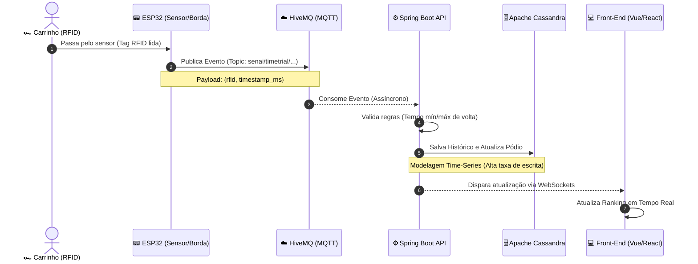

# 🏎️ Time Trial API

> Sistema de cronometragem de alta precisão para corridas de carrinhos com sensores RFID — processamento de eventos em tempo real, arquitetura orientada a eventos e ranking ao vivo.

---

## Badges


---

## 📖 Sobre o Projeto

A **Time Trial API** é o núcleo de um sistema de cronometragem inspirado no universo Hot Wheels. Sensores RFID instalados na pista leem as tags dos carrinhos ao passarem pelos pontos de controle, e cada leitura dispara uma cadeia completa de eventos: do hardware físico até o ranking exibido em tempo real no navegador.

O sistema foi projetado para lidar com **altíssima taxa de eventos por segundo**, garantindo que nenhuma leitura seja perdida e que a atualização do placar chegue ao Front-End em milissegundos.

---

## 🏗️ Arquitetura Orientada a Eventos

O fluxo de dados percorre cinco camadas independentes, desacopladas via mensageria assíncrona:



---

## 🧠 Decisões Arquiteturais

### 📟 Dispositivos de Borda (Edge Computing)
Microcontroladores **ESP32** são responsáveis pela leitura das tags RFID diretamente na pista. Ao detectar um carrinho, o ESP32 publica imediatamente um payload JSON no broker MQTT com o identificador da tag (`rfid`) e o timestamp preciso em milissegundos (`timestamp_ms`). Isso mantém a lógica de negócio inteiramente no backend, deixando o hardware leve e intercambiável.

### ☁️ Mensageria com MQTT (HiveMQ Cloud)
O protocolo **MQTT** foi escolhido por ser extremamente leve e confiável para dispositivos IoT com conectividade instável. O broker **HiveMQ Cloud** atua como intermediário: mesmo que a API esteja temporariamente indisponível, as mensagens não são perdidas. Essa camada desacopla completamente o hardware da lógica de negócio.

| Atributo | Valor |
|---|---|
| Protocolo | MQTT sobre SSL/TLS |
| Broker | HiveMQ Cloud |
| Tópico | `senai/timetrial/corrida/sensor` |
| QoS | 0 (at-most-once) |

### ⚙️ Processamento Assíncrono (Spring Boot)
O backend consome os eventos MQTT de forma **totalmente assíncrona**, usando o sistema de eventos do Spring (`ApplicationEventPublisher`). Cada mensagem recebida dispara um `CarroPassouNoSensorEvent`, que é processado em thread separada pelo `CalculadoraDeVoltaService`. Isso garante que a thread do receiver MQTT nunca fique bloqueada, maximizando o throughput.

### 🗄️ Banco de Dados Time-Series (Apache Cassandra)
A escolha do **Apache Cassandra** não foi acidental. O modelo de dados foi desenhado especificamente para o padrão de acesso desta aplicação — altíssima taxa de escrita e leituras ordenadas por tempo:

| Tabela | Partition Key | Clustering Key | Finalidade |
|---|---|---|---|
| `feed_recente` | `agrupador` | `timestamp_ms DESC` | Últimas voltas de todas as corridas |
| `historico_carro` | `carro_id` | `timestamp_ms DESC` | Histórico completo por carrinho |
| `podio_global` | `agrupador` | `tempo_volta_ms ASC` | Ranking ordenado automaticamente |

O Cassandra é otimizado para gravações (append-only log), o que o torna ideal para séries temporais. A ordenação da clustering key elimina qualquer necessidade de ordenar os resultados em memória.

### 💻 Comunicação em Tempo Real (WebSockets)
Após processar e persistir uma volta válida, a API notifica o Front-End instantaneamente via **WebSockets** (STOMP sobre SockJS). O cliente Front-End se inscreve no destino `/topic/painel` e recebe um `PainelSaidaDTO` completo a cada atualização, sem precisar fazer polling.

---

## 🚀 Como Executar (Deploy Portátil)

O projeto utiliza **Docker Compose** com inicialização automatizada: o Cassandra sobe, aguarda ficar saudável e então um container de inicialização cria o keyspace e todas as tabelas automaticamente. Basta configurar o arquivo `.env`.

### Pré-requisitos

- [Docker](https://www.docker.com/get-started) e Docker Compose instalados
- Uma conta no [HiveMQ Cloud](https://www.hivemq.com/mqtt-cloud-broker/) (plano gratuito disponível)

### 1. Configure o arquivo `.env`

Crie um arquivo `.env` na raiz do projeto com suas credenciais do HiveMQ Cloud:

```env
USER_HIVEMQ=seu-usuario-hivemq
PASSWORD_HIVEMQ=sua-senha-hivemq
```

> ⚠️ **Nunca faça commit do arquivo `.env` com credenciais reais.** O `.gitignore` já está configurado para ignorá-lo.

### 2. Suba todos os serviços

```bash
docker compose up --build
```

O Docker Compose irá:
1. Construir a imagem da aplicação Spring Boot
2. Subir o container do Apache Cassandra
3. Aguardar o Cassandra ficar saudável (healthcheck automático)
4. Criar o keyspace `time_trial` e todas as tabelas via container de inicialização
5. Iniciar a API conectada ao Cassandra e ao HiveMQ

A API estará disponível em: `http://localhost:8080`

### 3. WebSocket

Conecte seu Front-End ao endpoint WebSocket:

```
ws://localhost:8080/ws
```

Inscreva-se no destino `/topic/painel` para receber atualizações de ranking em tempo real.

---

## 📁 Estrutura do Projeto

```
src/main/java/com/centroweg/iot/time_trial_api/
├── config/              # Configurações (Cassandra, MQTT, WebSocket, Async)
├── core/
│   ├── domain/          # Entidades do Cassandra (FeedRecente, HistoricoCarro, PodioGlobal)
│   ├── event/           # Eventos de domínio (CarroPassouNoSensorEvent, VoltaValidaCalculadaEvent...)
│   ├── repository/      # Interfaces de repositório Spring Data Cassandra
│   └── service/         # Lógica de negócio (CalculadoraDeVolta, FeedRecente, GerenciadorPodio)
├── inbound/
│   ├── dto/             # SensorPayloadDTO (entrada via MQTT)
│   └── mqtt/            # MqttReceiver — consome mensagens do broker
└── outbound/
    ├── dto/             # PainelSaidaDTO (saída via WebSocket)
    └── websocket/       # NotificadorWebSocket — envia updates ao Front-End
```

---

## 🛠️ Tecnologias Utilizadas

| Tecnologia | Versão | Função |
|---|---|---|
| Java | 21 | Linguagem principal |
| Spring Boot | 3.x | Framework da API |
| Spring Data Cassandra | — | Abstração do banco de dados |
| Spring WebSocket (STOMP) | — | Comunicação em tempo real |
| Eclipse Paho MQTT | — | Cliente MQTT |
| HiveMQ Cloud | — | Broker MQTT gerenciado |
| Apache Cassandra | latest | Banco de dados time-series |
| Docker / Docker Compose | — | Containerização e orquestração |
| Lombok | — | Redução de boilerplate |
