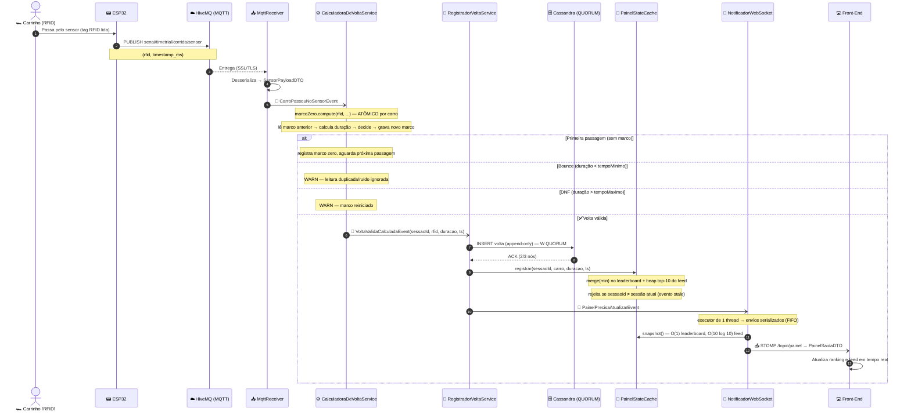

# 🏎️ Time Trial API

> Sistema de cronometragem de alta precisão para corridas de carrinhos com sensores RFID — processamento de eventos em tempo real, arquitetura orientada a eventos, log de voltas *append-only* e derivação de ranking em memória, livre de race conditions por design.

---

## Badges


---

## 📖 Sobre o Projeto

A **Time Trial API** é o núcleo de um sistema de cronometragem inspirado no universo Hot Wheels. Sensores RFID instalados na pista leem as tags dos carrinhos ao passarem pelo ponto de controle, e cada leitura dispara uma cadeia completa de eventos: do hardware físico até o ranking exibido em tempo real no navegador.

O sistema é projetado para lidar com **alta taxa de eventos por segundo** (alto throughput IoT), garantindo que nenhuma leitura seja perdida e que a atualização do placar chegue ao Front-End em milissegundos.

A versão atual é fruto de uma refatoração profunda cujo princípio central é:

> **Eliminar race conditions por design, e não por travas.** Em vez de guardar estado mutável compartilhado no banco (ler → modificar → regravar), o sistema grava apenas **fatos imutáveis** (`Volta`) num log *append-only* e **deriva** o leaderboard e o feed em memória. Sem estado mutável compartilhado, classes inteiras de bugs de concorrência simplesmente deixam de existir.

---

## 🧩 Conceitos Centrais

O domínio gira em torno de três conceitos. Entender os três é entender o sistema inteiro.

| Conceito | O que é | Por que existe |
|---|---|---|
| **Pista** (`pista`) | Configuração de uma pista física: `nome`, `tempoMinimoMs`, `tempoMaximoMs`. | Os limiares que definem o que é *bounce*, *DNF* e *volta válida* viraram **dado configurável por pista** — não mais constantes no código. |
| **Volta** (`volta`) | Fato imutável: `(sessaoId, carroId, ts, duracaoMs)`. | É o **log append-only** e a **fonte da verdade durável**. Nunca se atualiza nem deleta — só se acrescenta. Permite replay e reconstrução do estado. |
| **Sessão** | Uma corrida, identificada por um `UUID`, mantida em memória. Toda volta carrega o `sessaoId` dela. | Isola corridas entre si. Iniciar uma nova sessão "zera" o painel sem apagar o histórico do banco. |

> ⚠️ **Escopo atual:** o sistema roda **uma sessão/pista ativa por vez** (modelo single-session). O modelo de dados (`Volta` particionada por `sessao_id`) já suporta várias corridas coexistindo no banco; rodar **múltiplas pistas simultaneamente** é evolução planejada — veja [Roadmap](#-roadmap--evolução).

---

## 🏗️ Arquitetura do Sistema

O sistema se apoia em quatro pilares:

1. **Event-Driven Core** — processamento assíncrono via `ApplicationEventPublisher` do Spring, com handlers em pools de threads dedicados.
2. **Append-only + Derivação em memória** — o Cassandra guarda só fatos (`Volta`); leaderboard e feed são calculados em memória pelo `PainelStateCache`.
3. **Modularidade verificada** — fronteiras de módulo garantidas em tempo de teste com **Spring Modulith**.
4. **Tempo real** — saída *push* via WebSocket (STOMP) para o Front-End.

### Camadas (Spring Modulith)

```
inbound  →  core  →  outbound
```

- **`inbound`** — entrada do mundo externo (`MqttReceiver`, `SensorPayloadDTO`).
- **`core`** — o coração: `domain`, `event`, `repository`, `service` e a API pública (`core.api`). As fronteiras são declaradas via `@NamedInterface` e verificadas pelo `ModularityVerificationTest`.
- **`outbound`** — saída para o mundo (`NotificadorWebSocket`, controllers REST, DTOs de saída).

---

### Diagrama 1 — Arquitetura e Fluxo de Dados


```mermaid
flowchart LR
    subgraph BORDA["📟 Borda (Edge)"]
        ESP["ESP32 + Sensor RFID"]
    end

    subgraph MENSAGERIA["☁️ Mensageria (HiveMQ Cloud)"]
        MQTT["Broker MQTT\nsenai/timetrial/corrida/sensor\nSSL/TLS · QoS 0"]
    end

    subgraph BACKEND["⚙️ Spring Boot API (Event-Driven Core)"]
        direction TB
        RECV["MqttReceiver"]
        CALC["CalculadoraDeVoltaService\nmarcoZero em memória (atômico)"]
        REG["RegistradorVoltaService\núnico escritor da Volta"]
        CACHE["PainelStateCache\nleaderboard + feed em memória"]
        NOTIF["NotificadorWebSocket\nexecutor de 1 thread (FIFO)"]
        SESS["SessaoAtualHolder\nAtomicReference<EstadoSessao>"]
        ACTUATOR["Spring Actuator\n/actuator/prometheus"]
    end

    subgraph STORAGE["🗄️ Apache Cassandra (Ring — 3 Nós)"]
        direction LR
        C1["node-1 (Seed)"]
        C2["node-2"]
        C3["node-3"]
        C1 <-->|"Gossip"| C2
        C2 <-->|"Gossip"| C3
        C1 <-->|"Gossip"| C3
    end

    subgraph OBS["📊 Observabilidade"]
        PROM["Prometheus\n:9090 (scrape 5s)"]
        GRAF["Grafana\n:3000"]
    end

    subgraph FRONTEND["💻 Front-End"]
        WEB["Time Trial UI\nSTOMP /topic/painel"]
    end

    ESP -->|"PUBLISH {rfid, timestamp_ms}"| MQTT
    MQTT -->|"Entrega SSL/TLS"| RECV
    RECV -->|"CarroPassouNoSensorEvent"| CALC
    CALC -->|"VoltaValidaCalculadaEvent"| REG
    REG -->|"INSERT (append-only) W QUORUM"| STORAGE
    REG -->|"atualiza in-memory"| CACHE
    REG -->|"PainelPrecisaAtualizarEvent"| NOTIF
    NOTIF -->|"lê snapshot O(1)"| CACHE
    NOTIF -->|"STOMP Push PainelSaidaDTO"| WEB

    SESS -->|"SessaoIniciadaEvent (purga estado)"| CALC
    SESS -->|"SessaoIniciadaEvent (purga estado)"| CACHE
    WEB -->|"POST /api/sessoes/iniciar"| SESS
    WEB -->|"GET/POST /api/pistas"| STORAGE

    ACTUATOR -->|"scrape"| PROM
    PROM -->|"datasource"| GRAF
```

---

### Diagrama 2 — Fluxo de Sequência (de uma volta válida)


```mermaid
sequenceDiagram
    autonumber
    actor Carro as 🏎️ Carrinho (RFID)
    participant Edge as 📟 ESP32
    participant Broker as ☁️ HiveMQ (MQTT)
    participant Receiver as 📥 MqttReceiver
    participant Calc as ⚙️ CalculadoraDeVoltaService
    participant Reg as 💾 RegistradorVoltaService
    participant DB as 🗄️ Cassandra (QUORUM)
    participant Cache as 🧠 PainelStateCache
    participant Notif as 📡 NotificadorWebSocket
    participant Front as 💻 Front-End

    Carro->>Edge: Passa pelo sensor (tag RFID lida)
    Edge->>Broker: PUBLISH senai/timetrial/corrida/sensor
    Note over Edge,Broker: {rfid, timestamp_ms}
    Broker-->>Receiver: Entrega (SSL/TLS)
    Receiver->>Receiver: Desserializa → SensorPayloadDTO
    Receiver-)Calc: 🔔 CarroPassouNoSensorEvent

    Note over Calc: marcoZero.compute(rfid, ...) — ATÔMICO por carro
    Note over Calc: lê marco anterior → calcula duração → decide → grava novo marco

    alt Primeira passagem (sem marco)
        Note over Calc: registra marco zero, aguarda próxima passagem
    else Bounce (duração < tempoMinimo)
        Note over Calc: WARN — leitura duplicada/ruído ignorada
    else DNF (duração > tempoMaximo)
        Note over Calc: WARN — marco reiniciado
    else ✅ Volta válida
        Calc-)Reg: 🔔 VoltaValidaCalculadaEvent(sessaoId, rfid, duracao, ts)
        Reg->>DB: INSERT volta (append-only) — W QUORUM
        DB-->>Reg: ACK (2/3 nós)
        Reg->>Cache: registrar(sessaoId, carro, duracao, ts)
        Note over Cache: merge(min) no leaderboard + heap top-10 do feed
        Note over Cache: rejeita se sessaoId ≠ sessão atual (evento stale)
        Reg-)Notif: 🔔 PainelPrecisaAtualizarEvent
        Note over Notif: executor de 1 thread → envios serializados (FIFO)
        Notif->>Cache: snapshot() — O(1) leaderboard, O(10 log 10) feed
        Notif-)Front: 📤 STOMP /topic/painel → PainelSaidaDTO
        Front->>Front: Atualiza ranking e feed em tempo real
    end
```

---

## 🛡️ Concorrência: como evitamos race conditions

Esta é a essência da refatoração. Cada problema clássico de concorrência tem uma solução específica e justificada.

### 1. Cálculo da volta — *check-then-act* atômico
Calcular uma volta exige saber a última passagem do carro: *ler → calcular → gravar*. Feito no banco, isso é um *read-modify-write* não-atômico em rede, e duas leituras do mesmo carro em threads diferentes podiam computar voltas duplicadas.

**Solução** — `CalculadoraDeVoltaService` mantém o "marco zero" de cada carro num `ConcurrentHashMap` e usa `marcoZero.compute(rfid, ...)`. O `compute()` é **atômico por chave**: ler o marco anterior, calcular a duração, decidir (1ª passagem / bounce / DNF / válida) e gravar o novo marco acontecem de forma indivisível para um mesmo `rfid`. Carros diferentes seguem em paralelo. A fonte da verdade do "última passagem" saiu do banco (lento, em rede) para a memória local (rápida, atômica).

### 2. Sem estado mutável compartilhado — *lost update* eliminado
A `Volta` é **append-only** e tem **um único escritor** (`RegistradorVoltaService`), que só faz `INSERT` de linhas imutáveis. *Inserts nunca conflitam*; não existe linha compartilhada para sofrer *lost update*. Pódio e feed deixaram de ser dados gravados e passaram a ser derivados.

### 3. Derivação O(1) em memória — fim da *read amplification*
O `PainelStateCache` mantém o leaderboard (`ConcurrentHashMap<carroId, melhorTempo>` via `merge(min)`) e um feed limitado (top-10 mais recentes numa `PriorityQueue`). O snapshot do painel não toca o banco: O(1) para o leaderboard e O(10·log 10) para o feed. O Cassandra continua sendo o log durável para replay/restart.

### 4. Ordem dos envios WebSocket — executor de 1 thread
Notificações fora de ordem fariam o painel "andar para trás". O `NotificadorWebSocket` roda num executor dedicado de **uma única thread** (`notifierExecutor`), serializando os `convertAndSend` em FIFO. O processamento das voltas usa um pool de 4–8 threads (throughput); a saída usa 1 thread (ordem). Dois pools, dois objetivos.

### 5. Eventos de sessão "velha" — defesa em três camadas
Ao iniciar uma nova corrida, eventos em voo da anterior não podem contaminar o painel novo:
1. todo evento carrega o `sessaoId`;
2. `SessaoIniciadaEvent` é ouvido **de forma síncrona** e purga o `marcoZero` e o `PainelStateCache`;
3. `PainelStateCache.registrar()` **rejeita** voltas cujo `sessaoId` não bate com o atual, e o `compute()` trata sessão diferente como "sem passagem anterior".

### 6. Estado de sessão atômico e composto
`SessaoAtualHolder` guarda `EstadoSessao(sessaoId, pistaId, nomePista, tempoMinimo, tempoMaximo)` num único `AtomicReference`. A calculadora lê tudo num único `get` atômico — é impossível pegar o `sessaoId` novo com os limiares antigos durante uma troca de pista.

---

## 🧠 Decisões Arquiteturais

### 📟 Dispositivos de Borda (Edge)
Microcontroladores **ESP32** leem as tags RFID na pista e publicam um JSON `{rfid, timestamp_ms}` no broker MQTT. Toda a lógica de negócio fica no backend; o hardware é leve e intercambiável.

### ☁️ Mensageria com MQTT (HiveMQ Cloud)
O **MQTT** é leve e confiável para IoT com conectividade instável. O broker **HiveMQ Cloud** desacopla o hardware da lógica de negócio.

| Atributo | Valor |
|---|---|
| Protocolo | MQTT sobre SSL/TLS |
| Broker | HiveMQ Cloud |
| Tópico | `senai/timetrial/corrida/sensor` |
| QoS | 0 (at-most-once) |

### ⚙️ Processamento Assíncrono (Spring Boot)
A thread do receiver MQTT apenas publica um `CarroPassouNoSensorEvent` e retorna — nunca bloqueia. Os handlers `@EventListener @Async` processam em pools dedicados (`AsyncConfig`), maximizando o throughput.

### 🗄️ Banco de Dados Time-Series (Apache Cassandra)
O Cassandra é otimizado para escrita (append-only log) — ideal para séries temporais de alto volume. O modelo de dados foi desenhado para o padrão de acesso da aplicação:

| Tabela | Partition Key | Clustering Key | Finalidade |
|---|---|---|---|
| `volta` | `sessao_id` | `carro_id ASC, ts DESC` | Log imutável de voltas por sessão |
| `pista` | `id` | — | Configuração de pistas (limiares de tempo) |

**Consistência `QUORUM`:** todas as operações usam `QUORUM` — ao menos **2 dos 3 nós** confirmam antes do sucesso. Isso garante tolerância à falha de 1 nó (⌊N/2⌋+1 = 2 num cluster de 3) e integridade dos dados.

### 💻 Tempo Real (WebSockets)
Após persistir e registrar uma volta válida, a API empurra um `PainelSaidaDTO` via **STOMP sobre SockJS** para o destino `/topic/painel`. O cliente assina e recebe atualizações sem polling. Endpoint: `/ws-time-trial`.

---

## 📊 Telemetria e Observabilidade

Stack completa no padrão *"instrumentação → coleta → visualização"*:

### Instrumentação — Spring Boot Actuator
Métricas de JVM, pools de threads, conectividade com Cassandra e métricas de negócio expostas em `/actuator/prometheus` (formato OpenMetrics).

| Endpoint | Finalidade |
|---|---|
| `/actuator/health` | Status de saúde |
| `/actuator/prometheus` | Métricas (scrape target) |
| `/actuator/info` | Metadados da aplicação |

### Coleta — Prometheus
Scraping a cada **5 segundos** (`prometheus.yml`), com séries temporais comprimidas localmente (retenção 15 dias).

### Visualização — Grafana
**Grafana** (porta `3000`) consome o Prometheus e provisiona dashboards automaticamente (`grafana/provisioning`): API HTTP, persistência Cassandra, JVM runtime e taxa de ingestão de telemetria.

> 💡 `http://localhost:3000` — usuário `admin`, senha via `GRAFANA_ADMIN_PASSWORD` no `.env` (padrão `admin`).

---

## 🔌 Endpoints da API

| Método | Rota | Descrição |
|---|---|---|
| `POST` | `/api/pistas` | Cria uma pista (`nome`, `tempoMinimoMs`, `tempoMaximoMs`) |
| `GET` | `/api/pistas` | Lista as pistas cadastradas |
| `POST` | `/api/sessoes/iniciar` | Inicia/reseta a sessão; opcionalmente vinculada a uma `pistaId` |
| `WS` | `/ws-time-trial` → `/topic/painel` | Stream do painel em tempo real (STOMP/SockJS) |

---

## 🚀 Como Executar (Local — Docker Compose)

O projeto usa **Docker Compose** com orquestração em cascata: os nós do cluster Cassandra sobem sequencialmente (healthcheck via `cqlsh`); só após o cluster sincronizar (verificado via `SELECT rack FROM system.peers`), o `cassandra-init` cria o keyspace e as tabelas `volta` e `pista`. Em seguida sobem Prometheus, Grafana e a API.

### Sequência de Inicialização

```
cassandra-1 (Seed) → [healthcheck: cqlsh]
    └─► cassandra-2 (joins ring via Gossip) → [healthcheck]
            └─► cassandra-3 (joins ring via Gossip)
cassandra-init → [aguarda 2 peers via CQL]
    └─► CREATE KEYSPACE (NetworkTopologyStrategy, dc1:3)
    └─► CREATE TABLE volta, pista
prometheus + grafana (em paralelo)
time-trial-api → [conecta aos 3 contact-points]
```

### Pré-requisitos
- [Docker](https://www.docker.com/get-started) e Docker Compose
- Conta no [HiveMQ Cloud](https://www.hivemq.com/mqtt-cloud-broker/) (plano gratuito)

### 1. Configure o `.env`

```env
USER_HIVEMQ=seu-usuario-hivemq
PASSWORD_HIVEMQ=sua-senha-hivemq
GRAFANA_ADMIN_PASSWORD=admin
```

> ⚠️ **Nunca faça commit do `.env`.** O `.gitignore` já o ignora.

### 2. Suba tudo

```bash
docker compose up --build
```

### 3. Endpoints Disponíveis

| Serviço | URL |
|---|---|
| **API REST** | `http://localhost:8080` |
| **WebSocket** | `http://localhost:8080/ws-time-trial` |
| **Prometheus** | `http://localhost:9090` |
| **Grafana** | `http://localhost:3000` |

> O endpoint WebSocket usa **SockJS**: clientes devem usar prefixo `http://` (não `ws://`). Assine `/topic/painel` para receber o ranking.

---

## ☁️ Deploy na AWS (ECS + Amazon Keyspaces)

A aplicação roda também em produção na AWS, sem Cassandra auto-gerenciado:

- **Amazon Keyspaces** (Cassandra gerenciado) — ativado via `AWS_KEYSPACES_ENABLED=true`, com autenticação **SigV4** (`aws-sigv4-auth-cassandra-java-driver-plugin`). Schema em [`aws/keyspaces-schema.cql`](aws/keyspaces-schema.cql).
- **Amazon ECS** — container definido em [`aws/task-definition.json`](aws/task-definition.json), imagem publicada no **ECR**.
- **CI/CD** — workflow [`.github/workflows/deploy.yml`](.github/workflows/deploy.yml) faz build e deploy a cada push na `main`, autenticando via **OIDC** (sem chaves hardcoded).

Runbooks detalhados: [`aws/DEPLOY-RUNBOOK.md`](aws/DEPLOY-RUNBOOK.md) e [`aws/EC2-DEPLOY-RUNBOOK.md`](aws/EC2-DEPLOY-RUNBOOK.md).

---

## 📁 Estrutura do Projeto

```
src/main/java/com/centroweg/iot/time_trial_api/
├── config/              # Cassandra, MQTT, WebSocket, Async
├── core/                # Módulo central (Spring Modulith)
│   ├── api/             # Interface pública: PainelSaidaDTO, LeaderboardEntryDTO, VoltaFeedDTO
│   ├── domain/          # Entidades: Pista, Volta
│   ├── event/           # Eventos: CarroPassouNoSensor, VoltaValidaCalculada, PainelPrecisaAtualizar, SessaoIniciada
│   ├── exception/       # Exceções de domínio
│   ├── repository/      # PistaRepository, VoltaRepository (Spring Data Cassandra)
│   └── service/         # CalculadoraDeVolta, RegistradorVolta, PainelStateCache,
│                        #   PainelService, PistaService, SessaoAtualHolder
├── inbound/
│   ├── dto/             # SensorPayloadDTO (entrada MQTT)
│   └── mqtt/            # MqttReceiver
└── outbound/
    ├── web/             # PistaController, SessaoController, GlobalExceptionHandler, DTOs
    └── websocket/       # NotificadorWebSocket
```

---

## 🗺️ Roadmap — Evolução

- **Múltiplas pistas simultâneas.** Hoje o runtime é single-session (uma corrida ativa por vez). O modelo de dados já suporta várias sessões coexistindo; falta (a) dar **identidade de pista à ingestão** — o payload MQTT precisa indicar de qual pista veio — e (b) indexar os singletons em memória por pista (`Map<pistaId, ...>` em `SessaoAtualHolder`, `PainelStateCache` e na chave do `marcoZero`), além de WebSocket por pista (`/topic/painel/{pistaId}`).
- **Analytics em batch.** O log `volta` (append-only, durável) é a base natural para um endpoint REST de leitura em lote alimentando um módulo de Data Science (clustering de pilotos, detecção de outliers).
- **Replay/restart.** Reconstruir o `PainelStateCache` a partir do log `volta` ao subir a aplicação.

---

## 🛠️ Tecnologias Utilizadas

| Tecnologia | Versão | Função |
|---|---|---|
| Java | 21 | Linguagem principal |
| Spring Boot | 3.5.x | Framework da API |
| Spring Modulith | 1.3.x | Modularidade verificada em testes |
| Spring Data Cassandra | — | Abstração do banco de dados |
| Spring WebSocket (STOMP) | — | Comunicação em tempo real |
| Spring Boot Actuator | — | Métricas e health checks |
| Eclipse Paho MQTT | 1.2.5 | Cliente MQTT |
| HiveMQ Cloud | — | Broker MQTT gerenciado |
| Apache Cassandra | latest | Banco time-series (cluster 3 nós, QUORUM) |
| Amazon Keyspaces | — | Cassandra gerenciado (produção, SigV4) |
| Prometheus | latest | Coleta de métricas (scrape 5s) |
| Grafana | latest | Visualização e dashboards |
| Docker / Docker Compose | — | Containerização e orquestração |
| AWS ECS / ECR | — | Execução e registry em produção |
| Lombok | — | Redução de boilerplate |
</content>
</invoke>
