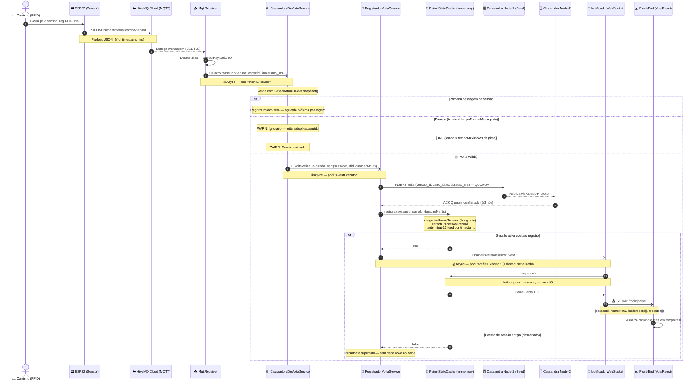

# 🏎️ Time Trial API

> Sistema de cronometragem em tempo real para corridas de carrinhos com sensores RFID — arquitetura modular orientada a eventos, estado em memória de alta performance e notificações push via WebSocket.

---

## Badges


---

## 📖 Sobre o Projeto

A **Time Trial API** é o núcleo de um sistema de cronometragem inspirado no universo Hot Wheels. Sensores RFID instalados na pista leem as tags dos carrinhos ao passarem pelo ponto de controle, e cada leitura dispara uma cadeia de eventos: do hardware físico até o ranking exibido em tempo real no navegador.

O sistema é organizado como um **monólito modular** com Spring Modulith, separando claramente as responsabilidades entre módulos de entrada (MQTT), núcleo de negócio (eventos, domínio, estado) e saída (WebSocket, REST). O estado do painel — leaderboard e feed de voltas recentes — é mantido em memória para latência mínima, enquanto o Cassandra persiste o histórico durável de voltas.

---

## 🏗️ Arquitetura do Sistema

O sistema é construído sobre três pilares:

1. **Event-Driven Core** — processamento assíncrono via `ApplicationEventPublisher` do Spring, com dois pools de threads dedicados: um para eventos de negócio (`eventExecutor`) e um isolado para notificações WebSocket (`notifierExecutor`).
2. **Estado em Memória (PainelStateCache)** — leaderboard e feed de voltas recentes são mantidos em estruturas thread-safe em memória (`ConcurrentHashMap` + `PriorityQueue`), zerando a latência de leitura para o WebSocket.
3. **Persistência Durável (Apache Cassandra)** — o histórico de voltas válidas é gravado em cluster Cassandra com consistência `QUORUM`, garantindo durabilidade e tolerância a falhas de nó.

---

### Diagrama 1 — Arquitetura e Fluxo de Dados


```mermaid
flowchart LR
    subgraph BORDA["📟 Camada de Borda (Edge)"]
        ESP["ESP32 + Sensor RFID"]
    end

    subgraph MENSAGERIA["☁️ Mensageria (HiveMQ Cloud)"]
        MQTT["Broker MQTT\nSSL/TLS · QoS 0"]
    end

    subgraph BACKEND["⚙️ Spring Boot API (Modular Event-Driven)"]
        direction TB
        RECV["inbound.mqtt\nMqttReceiver"]
        CALC["core.service\nCalculadoraDeVoltaService\n@EventListener @Async"]
        REG["core.service\nRegistradorVoltaService\n@EventListener @Async"]
        CACHE["core.service\nPainelStateCache\n(estado in-memory)"]
        SESSAO["core.service\nSessaoAtualHolder\n(AtomicReference)"]
        NOTIF["outbound.websocket\nNotificadorWebSocket\n@EventListener @Async"]
        REST["outbound.web\nSessaoController · PistaController"]
        ACTUATOR["Spring Actuator\n/actuator/prometheus"]
    end

    subgraph STORAGE["🗄️ Cluster Apache Cassandra (Ring — 3 Nós)"]
        direction LR
        C1["cassandra-node-1\n(Seed)"]
        C2["cassandra-node-2"]
        C3["cassandra-node-3"]
        C1 <-->|"Gossip Protocol"| C2
        C2 <-->|"Gossip Protocol"| C3
        C1 <-->|"Gossip Protocol"| C3
    end

    subgraph OBS["📊 Observabilidade"]
        PROM["Prometheus\n:9090"]
        GRAF["Grafana\n:3000"]
    end

    subgraph FRONTEND["💻 Front-End"]
        REACT["React / Vue\nSTOMP /topic/painel"]
    end

    ESP -->|"PUBLISH JSON\n{rfid, timestamp_ms}"| MQTT
    MQTT -->|"Entrega SSL/TLS"| RECV
    RECV -->|"CarroPassouNoSensorEvent"| CALC
    CALC -->|"VoltaValidaCalculadaEvent"| REG
    REG -->|"W QUORUM"| STORAGE
    REG -->|"registrar()"| CACHE
    REG -->|"PainelPrecisaAtualizarEvent\n(somente se sessão aceita)"| NOTIF
    NOTIF -->|"snapshot() — sem I/O"| CACHE
    NOTIF -->|"STOMP Push\nPainelSaidaDTO"| REACT
    REST -->|"iniciarNovaSessao()"| SESSAO
    SESSAO -->|"SessaoIniciadaEvent\n(limpa cache)"| CACHE
    REST -->|"R/W QUORUM"| STORAGE
    ACTUATOR -->|"scrape /actuator/prometheus"| PROM
    PROM -->|"datasource"| GRAF
```

---

### Diagrama 2 — Fluxo de Sequência Event-Driven


```mermaid
sequenceDiagram
    autonumber
    actor Carro as 🏎️ Carrinho (RFID)
    participant Edge as 📟 ESP32 (Sensor)
    participant Broker as ☁️ HiveMQ Cloud (MQTT)
    participant Receiver as 📥 MqttReceiver
    participant Calc as ⚙️ CalculadoraDeVoltaService
    participant Reg as 💾 RegistradorVoltaService
    participant Cache as 🧠 PainelStateCache (in-memory)
    participant C1 as 🗄️ Cassandra Node-1 (Seed)
    participant C2 as 🗄️ Cassandra Node-2
    participant Notif as 📡 NotificadorWebSocket
    participant Front as 💻 Front-End (Vue/React)

    Carro->>Edge: Passa pelo sensor (Tag RFID lida)
    Edge->>Broker: PUBLISH senai/timetrial/corrida/sensor
    Note over Edge,Broker: Payload JSON: {rfid, timestamp_ms}
    Broker-->>Receiver: Entrega mensagem (SSL/TLS)
    Receiver->>Receiver: Desserializa → SensorPayloadDTO

    Receiver-)Calc: 🔔 CarroPassouNoSensorEvent(rfid, timestamp_ms)
    Note over Receiver,Calc: @Async — pool "eventExecutor"

    Note over Calc: Valida com SessaoAtualHolder.snapshot()
    alt Primeira passagem na sessão
        Note over Calc: Registra marco zero — aguarda próxima passagem
    else Bounce (tempo < tempoMinimoMs da pista)
        Note over Calc: WARN: Ignorado — leitura duplicada/ruído
    else DNF (tempo > tempoMaximoMs da pista)
        Note over Calc: WARN: Marco reiniciado
    else ✅ Volta válida
        Calc-)Reg: 🔔 VoltaValidaCalculadaEvent(sessaoId, rfid, duracaoMs, ts)
        Note over Calc,Reg: @Async — pool "eventExecutor"

        Reg->>C1: INSERT volta (sessao_id, carro_id, ts, duracao_ms) — QUORUM
        C1-->>C2: Replica via Gossip Protocol
        C2-->>Reg: ACK Quórum confirmado (2/3 nós)

        Reg->>Cache: registrar(sessaoId, carroId, duracaoMs, ts)
        Note over Cache: merge melhoresTempos (Long::min)<br/>detecta isPessoalRecord<br/>mantém top-10 feed por timestamp

        alt Sessão ativa aceita o registro
            Cache-->>Reg: true
            Reg-)Notif: 🔔 PainelPrecisaAtualizarEvent
            Note over Reg,Notif: @Async — pool "notifierExecutor" (1 thread, serializado)
            Notif->>Cache: snapshot()
            Note over Cache,Notif: Leitura pura in-memory — zero I/O
            Cache-->>Notif: PainelSaidaDTO
            Notif-)Front: 📤 STOMP /topic/painel
            Note over Notif,Front: {sessaoId, nomePista, leaderboard[], recentes[]}
            Front->>Front: Atualiza ranking e feed em tempo real
        else Evento de sessão antiga (descartado)
            Cache-->>Reg: false
            Note over Reg: Broadcast suprimido — sem dado novo no painel
        end
    end
```

---

## 🧠 Decisões Arquiteturais

### 📟 Dispositivos de Borda (Edge Computing)
Microcontroladores **ESP32** são responsáveis pela leitura das tags RFID na pista. Ao detectar um carrinho, o ESP32 publica um payload JSON no broker MQTT com o identificador da tag (`rfid`) e o timestamp em milissegundos (`timestamp_ms`). A lógica de negócio reside inteiramente no backend, mantendo o hardware leve e intercambiável.

### ☁️ Mensageria com MQTT (HiveMQ Cloud)
O protocolo **MQTT** foi escolhido por ser extremamente leve e confiável para IoT. O broker **HiveMQ Cloud** desacopla o hardware da API: mesmo que a API esteja temporariamente indisponível, as mensagens são mantidas no broker.

| Atributo | Valor |
|---|---|
| Protocolo | MQTT sobre SSL/TLS |
| Broker | HiveMQ Cloud |
| Tópico | `senai/timetrial/corrida/sensor` |
| QoS | 0 (at-most-once) |

### ⚙️ Processamento Assíncrono com Dois Pools Isolados
O backend processa eventos MQTT de forma **totalmente assíncrona** via `ApplicationEventPublisher`. Dois executores com responsabilidades distintas eliminam interferências entre o processamento de negócio e as notificações WebSocket:

| Executor | Threads | Fila | Responsabilidade |
|---|---|---|---|
| `eventExecutor` | 4–8 | 100 | `CalculadoraDeVoltaService`, `RegistradorVoltaService` |
| `notifierExecutor` | 1 | 500 | `NotificadorWebSocket` (serializa broadcasts) |

A thread única do `notifierExecutor` garante que os broadcasts WebSocket sejam enviados em ordem, sem concorrência.

### 🧠 Estado em Memória (PainelStateCache)
O leaderboard e o feed de voltas recentes são mantidos pelo `PainelStateCache` em estruturas thread-safe na JVM:

- **Leaderboard:** `ConcurrentHashMap<carroId, melhorTempo>` — operação `merge(Long::min)` é atômica e detecta automaticamente o `isPessoalRecord`
- **Feed:** `PriorityQueue` com min-heap por `timestamp`, limitada às 10 entradas mais recentes, com acesso protegido por `synchronized`
- **Contexto:** `sessaoIdAtual` e `nomePistaAtual` armazenados como campos `volatile`, populados via `SessaoIniciadaEvent`

A leitura para o WebSocket via `snapshot()` é pura — **zero I/O com o banco**, latência de sub-milissegundo.

### 🏁 Gerenciamento de Sessões e Pistas
Cada sessão de corrida é gerenciada pelo `SessaoAtualHolder` via `AtomicReference<EstadoSessao>`, garantindo leitura consistente do par `(sessaoId, thresholds)` sem race conditions. Uma sessão pode ser vinculada a uma `Pista`, que define os limiares `tempoMinimoMs` e `tempoMaximoMs` usados para validar as voltas.

Ao iniciar uma nova sessão, o `SessaoIniciadaEvent` é publicado e escutado por:
- `PainelStateCache` → zera leaderboard e feed
- `CalculadoraDeVoltaService` → limpa os marcos zero dos carros

### 🗄️ Apache Cassandra — Persistência Durável
O Cassandra é responsável por **durabilidade**, não por estado em tempo real. Opera em **cluster ring de 3 nós** com `NetworkTopologyStrategy` e consistência `QUORUM` (2/3 nós) para todas as escritas.

**Tabelas do schema:**

| Tabela | Partition Key | Clustering Key | Finalidade |
|---|---|---|---|
| `volta` | `sessao_id` | `carro_id ASC, ts DESC` | Histórico de voltas válidas por sessão |
| `pista` | `id` | — | Cadastro de pistas com thresholds de tempo |

### 💻 Comunicação em Tempo Real (WebSocket)
O `NotificadorWebSocket` escuta `PainelPrecisaAtualizarEvent` e publica o snapshot atual do `PainelStateCache` via STOMP para o tópico `/topic/painel`.

**Payload enviado ao Front-End:**
```json
{
  "sessaoId": "uuid-da-sessao",
  "nomePista": "Pista Principal",
  "leaderboard": [
    { "posicao": 1, "carroId": "RFID_ABC", "duracaoMs": 32450 }
  ],
  "recentes": [
    { "carroId": "RFID_ABC", "duracaoMs": 32450, "ts": 1718200000000, "pessoalRecord": true }
  ]
}
```

> `nomePista` é `null` quando a sessão foi iniciada sem pista vinculada. `pessoalRecord: true` indica que a volta é o novo melhor tempo do carro na sessão atual.

### 🧩 Spring Modulith — Fronteiras de Módulo
O projeto usa **Spring Modulith** com `@NamedInterface` para declarar explicitamente os subpacotes públicos de cada módulo. O módulo `core` expõe três interfaces nomeadas:

| Interface (`@NamedInterface`) | Pacote | O que expõe |
|---|---|---|
| `"api"` | `core.api` | DTOs de saída (`PainelSaidaDTO`, `LeaderboardEntryDTO`, `VoltaFeedDTO`) |
| `"events"` | `core.event` | Eventos de domínio (`CarroPassouNoSensorEvent`, `VoltaValidaCalculadaEvent`, etc.) |
| `"domain"` | `core.domain` | Entidades Cassandra (`Volta`, `Pista`) |
| `"services"` | `core.service` | Serviços internos |

---

## 📊 Telemetria e Observabilidade

### Spring Boot Actuator
A aplicação expõe métricas de JVM, pools de threads, conectividade com Cassandra e métricas de negócio pelo endpoint `/actuator/prometheus` em formato OpenMetrics.

| Endpoint | Finalidade |
|---|---|
| `/actuator/health` | Status da aplicação e dependências |
| `/actuator/prometheus` | Métricas para scraping (Prometheus) |
| `/actuator/metrics` | Catálogo de métricas disponíveis |

### Prometheus + Grafana
O Prometheus realiza scraping a cada **5 segundos** e o Grafana exibe dashboards em tempo real.

```yaml
# prometheus.yml
scrape_configs:
  - job_name: 'time-trial-api'
    metrics_path: '/actuator/prometheus'
    static_configs:
      - targets: ['time-trial-api:8080']
```

> 💡 Acesse o Grafana em `http://localhost:3000` (credenciais padrão: `admin` / `admin`, configurável via `GRAFANA_ADMIN_PASSWORD` no `.env`).

---

## 🚀 Como Executar

O projeto usa **Docker Compose** com inicialização em cascata: os nós do cluster Cassandra sobem sequencialmente via healthcheck, o `cassandra-init` aguarda 2 peers sincronizados antes de criar o schema, e a API só sobe após o `cassandra-init` completar com sucesso.

### Sequência de Inicialização

```
cassandra-node-1 (Seed) → [healthcheck: cqlsh]
    └─► cassandra-node-2 (joins ring via Gossip) → [healthcheck: cqlsh]
            └─► cassandra-node-3 (joins ring via Gossip)
cassandra-init → [aguarda 2 peers via SELECT rack FROM system.peers]
    └─► CREATE KEYSPACE time_trial (NetworkTopologyStrategy, dc1:3)
    └─► CREATE TABLE volta
    └─► CREATE TABLE pista
prometheus + grafana (em paralelo após cluster)
time-trial-api → [conecta aos 3 contact-points]
```

### Pré-requisitos

- [Docker](https://www.docker.com/get-started) e Docker Compose instalados
- Uma conta no [HiveMQ Cloud](https://www.hivemq.com/mqtt-cloud-broker/) (plano gratuito disponível)

### 1. Configure o arquivo `.env`

```env
USER_HIVEMQ=seu-usuario-hivemq
PASSWORD_HIVEMQ=sua-senha-hivemq
GRAFANA_ADMIN_PASSWORD=admin
```

> ⚠️ **Nunca faça commit do arquivo `.env` com credenciais reais.** O `.gitignore` já está configurado para ignorá-lo.

### 2. Suba todos os serviços

```bash
docker compose up --build
```

### 3. Endpoints Disponíveis

| Serviço | URL | Descrição |
|---|---|---|
| **API REST** | `http://localhost:8080` | API principal |
| **WebSocket** | `http://localhost:8080/ws-time-trial` | Endpoint SockJS/STOMP |
| **Prometheus** | `http://localhost:9090` | Console de métricas e PromQL |
| **Grafana** | `http://localhost:3000` | Dashboard de observabilidade |

### 4. REST API

#### Pistas

| Método | Endpoint | Descrição |
|---|---|---|
| `GET` | `/api/pistas` | Lista todas as pistas cadastradas |
| `POST` | `/api/pistas` | Cria uma nova pista |

```json
// POST /api/pistas — body
{
  "nome": "Pista Principal",
  "tempoMinimoMs": 15000,
  "tempoMaximoMs": 90000
}
```

#### Sessões

| Método | Endpoint | Descrição |
|---|---|---|
| `POST` | `/api/sessoes/iniciar` | Inicia nova sessão (zera leaderboard e feed) |

```json
// POST /api/sessoes/iniciar — body (pistaId é opcional)
{ "pistaId": "uuid-da-pista" }

// Response
{ "sessaoId": "novo-uuid", "pistaId": "uuid-da-pista" }
```

> Iniciar uma sessão sem `pistaId` (body vazio ou ausente) usa os thresholds padrão definidos no `application.yaml`.

### 5. WebSocket

Conecte o Front-End usando **SockJS + STOMP** e inscreva-se em `/topic/painel`:

```javascript
// Endpoint de conexão (SockJS — usar http://, não ws://)
http://localhost:8080/ws-time-trial

// Tópico de subscrição
/topic/painel
```

---

## 📁 Estrutura do Projeto

```
src/main/java/com/centroweg/iot/time_trial_api/
├── config/                  # Configurações (Cassandra, MQTT, WebSocket, Async)
├── core/
│   ├── api/                 # DTOs públicos de saída (@NamedInterface "api")
│   │   ├── PainelSaidaDTO
│   │   ├── LeaderboardEntryDTO
│   │   └── VoltaFeedDTO
│   ├── domain/              # Entidades Cassandra (@NamedInterface "domain")
│   │   ├── Volta
│   │   └── Pista
│   ├── event/               # Eventos de domínio (@NamedInterface "events")
│   │   ├── CarroPassouNoSensorEvent
│   │   ├── VoltaValidaCalculadaEvent
│   │   ├── PainelPrecisaAtualizarEvent
│   │   └── SessaoIniciadaEvent
│   ├── exception/           # Exceções de domínio
│   ├── repository/          # Interfaces Spring Data Cassandra
│   └── service/             # Lógica de negócio (@NamedInterface "services")
│       ├── CalculadoraDeVoltaService
│       ├── RegistradorVoltaService
│       ├── PainelStateCache
│       ├── PainelService
│       ├── SessaoAtualHolder
│       └── PistaService
├── inbound/
│   ├── dto/                 # SensorPayloadDTO (entrada MQTT)
│   └── mqtt/                # MqttReceiver
└── outbound/
    ├── web/
    │   ├── controller/      # SessaoController, PistaController
    │   └── dto/             # DTOs de request/response REST
    └── websocket/           # NotificadorWebSocket
```

---

## 🛠️ Tecnologias Utilizadas

| Tecnologia | Versão | Função |
|---|---|---|
| Java | 21 | Linguagem principal |
| Spring Boot | 3.5 | Framework da API |
| Spring Modulith | 1.3 | Modularização e fronteiras de módulo |
| Spring Data Cassandra | — | Abstração do banco de dados |
| Spring WebSocket (STOMP) | — | Comunicação em tempo real |
| Spring Boot Actuator | — | Métricas e health checks |
| Eclipse Paho MQTT | 1.2.5 | Cliente MQTT |
| HiveMQ Cloud | — | Broker MQTT gerenciado (SSL/TLS) |
| Apache Cassandra | latest | Persistência durável (cluster 3 nós, QUORUM) |
| Prometheus | latest | Coleta de métricas (scrape 5s) |
| Grafana | latest | Dashboards de observabilidade |
| Docker / Docker Compose | — | Containerização e orquestração em cascata |
| Lombok | — | Redução de boilerplate |
