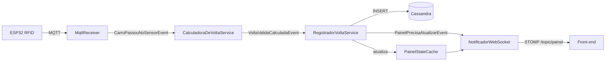

# Time Trial API

Sistema de cronometragem para corridas de carrinhos com sensores RFID. Leituras de sensores chegam por MQTT, são processadas de forma assíncrona e o ranking é transmitido em tempo real ao front-end via WebSocket.


## Visão geral

Sensores ESP32 com leitor RFID detectam os carrinhos ao passarem pelo ponto de controle e publicam `{rfid, timestamp_ms}` em um broker MQTT. O backend calcula a duração de cada volta, persiste o resultado e atualiza o painel conectado.

O ponto central do projeto está em como o estado concorrente é tratado. Em vez de manter ranking e feed como estado mutável no banco (ler, modificar, regravar), o sistema grava apenas voltas imutáveis em um log *append-only* e deriva ranking e feed em memória. Isso elimina as condições de corrida em vez de protegê-las com locks.

## Conceitos

| Conceito | Descrição |
|---|---|
| `Pista` | Configuração de uma pista: nome e os limites de tempo (`tempoMinimoMs`, `tempoMaximoMs`) que definem volta válida, *bounce* e DNF. |
| `Volta` | Registro imutável `(sessaoId, carroId, ts, duracaoMs)`. Log append-only e fonte da verdade durável. |
| Sessão | Uma corrida, identificada por UUID e mantida em memória. Cada volta carrega o `sessaoId` ao qual pertence. |

O runtime opera com uma sessão ativa por vez. O modelo de dados já comporta sessões simultâneas no banco; execução de múltiplas pistas em paralelo está no [roadmap](#roadmap).

## Fluxo


```mermaid
flowchart LR
    ESP[ESP32 RFID] -->|MQTT| RECV[MqttReceiver]
    RECV -->|CarroPassouNoSensorEvent| CALC[CalculadoraDeVoltaService]
    CALC -->|VoltaValidaCalculadaEvent| REG[RegistradorVoltaService]
    REG -->|INSERT| DB[(Cassandra)]
    REG -->|atualiza| CACHE[PainelStateCache]
    REG -->|PainelPrecisaAtualizarEvent| NOTIF[NotificadorWebSocket]
    NOTIF -->|STOMP /topic/painel| FRONT[Front-end]
    CACHE --> NOTIF
```

Cada etapa é desacoplada por eventos de aplicação do Spring (`ApplicationEventPublisher`). O receiver MQTT apenas publica um evento e libera a thread; os handlers `@Async` processam em pools dedicados.

## Concorrência

A versão atual resulta de uma refatoração focada em remover estado mutável compartilhado. As decisões principais:

- **Cálculo atômico por carro** — `CalculadoraDeVoltaService` guarda o último ponto de cada carro em um `ConcurrentHashMap` e decide a volta dentro de `compute(rfid, ...)`. A operação é atômica por chave: dois eventos do mesmo carro não se intercalam; carros diferentes seguem em paralelo.
- **Log append-only com escritor único** — só o `RegistradorVoltaService` grava na tabela `volta`, e apenas com `INSERT`. Inserts não conflitam, então não há *lost update*.
- **Derivação em memória** — `PainelStateCache` mantém o ranking (melhor tempo por carro) e o feed (últimas voltas) em memória. O snapshot do painel não consulta o banco.
- **Saída serializada** — o `NotificadorWebSocket` roda em um executor de thread única, garantindo a ordem dos envios. O processamento usa um pool de 4–8 threads; a saída usa uma só.
- **Isolamento de sessão** — todo evento carrega o `sessaoId`. Ao iniciar uma sessão, o estado em memória é limpo e eventos de sessões anteriores são descartados.

## Persistência (Cassandra)

Cassandra é otimizado para escrita append-only, adequado a séries temporais de alta volumetria. O modelo segue o padrão de acesso da aplicação:

| Tabela | Partition key | Clustering key |
|---|---|---|
| `volta` | `sessao_id` | `carro_id ASC, ts DESC` |
| `pista` | `id` | — |

Todas as operações usam consistência `QUORUM` (2 de 3 nós), tolerando a falha de um nó sem perder consistência.

## Modularidade

O código é organizado em módulos com fronteiras explícitas (`inbound`, `core`, `outbound`), usando Spring Modulith. Apenas o subpacote `core.api` é exposto às demais camadas, via `@NamedInterface`. O `ModularityVerificationTest` falha o build se uma fronteira for violada — a separação é verificada, não apenas convencionada.

## Observabilidade

Spring Boot Actuator expõe métricas de JVM, pools de threads, conexão com o Cassandra e métricas de negócio em `/actuator/prometheus`. O Prometheus coleta a cada 5 segundos e o Grafana provisiona automaticamente os dashboards em `grafana/provisioning` (API HTTP, persistência, JVM e taxa de ingestão).

## API

| Método | Rota | Descrição |
|---|---|---|
| `POST` | `/api/pistas` | Cria uma pista |
| `GET` | `/api/pistas` | Lista as pistas |
| `POST` | `/api/sessoes/iniciar` | Inicia uma sessão, opcionalmente vinculada a uma `pistaId` |
| `WS` | `/ws-time-trial` → `/topic/painel` | Painel em tempo real (STOMP/SockJS) |

## Execução local

Pré-requisitos: Docker e Docker Compose; uma conta no [HiveMQ Cloud](https://www.hivemq.com/mqtt-cloud-broker/).

Crie um `.env` na raiz:

```env
USER_HIVEMQ=seu-usuario
PASSWORD_HIVEMQ=sua-senha
GRAFANA_ADMIN_PASSWORD=admin
```

Suba os serviços:

```bash
docker compose up --build
```

O Compose sobe o cluster Cassandra de 3 nós em cascata, cria o keyspace e as tabelas (`volta`, `pista`), e então inicia Prometheus, Grafana e a API.

| Serviço | URL |
|---|---|
| API REST | `http://localhost:8080` |
| WebSocket | `http://localhost:8080/ws-time-trial` |
| Prometheus | `http://localhost:9090` |
| Grafana | `http://localhost:3000` |

O endpoint WebSocket usa SockJS — clientes devem usar o prefixo `http://`. Assine `/topic/painel` para receber o ranking.

## Deploy na AWS

A aplicação também roda em ECS com Amazon Keyspaces (Cassandra gerenciado):

- Keyspaces ativado por `AWS_KEYSPACES_ENABLED=true`, com autenticação SigV4. Schema em [`aws/keyspaces-schema.cql`](aws/keyspaces-schema.cql).
- Task definition do ECS em [`aws/task-definition.json`](aws/task-definition.json); imagem publicada no ECR.
- CI/CD em [`.github/workflows/deploy.yml`](.github/workflows/deploy.yml), com autenticação via OIDC.

Detalhes em [`aws/DEPLOY-RUNBOOK.md`](aws/DEPLOY-RUNBOOK.md) e [`aws/EC2-DEPLOY-RUNBOOK.md`](aws/EC2-DEPLOY-RUNBOOK.md).

## Estrutura

```
src/main/java/com/centroweg/iot/time_trial_api/
├── config/      Cassandra, MQTT, WebSocket, Async
├── core/        Módulo central (Spring Modulith)
│   ├── api/         Interface pública (PainelSaidaDTO, LeaderboardEntryDTO, VoltaFeedDTO)
│   ├── domain/      Pista, Volta
│   ├── event/       Eventos de domínio
│   ├── exception/   Exceções de domínio
│   ├── repository/  Spring Data Cassandra
│   └── service/     Cálculo, registro, cache do painel, sessão, pista
├── inbound/     Entrada MQTT (MqttReceiver, SensorPayloadDTO)
└── outbound/    Controllers REST e WebSocket
```

## Roadmap

- **Múltiplas pistas simultâneas.** Requer identidade de pista na ingestão (o payload MQTT precisa indicar a pista) e indexação por pista do estado em memória e do tópico WebSocket.
- **Analytics em batch.** O log `volta` é base natural para um endpoint de leitura em lote alimentando análise de dados.
- **Replay na inicialização.** Reconstruir o `PainelStateCache` a partir do log `volta` ao subir a aplicação.

## Tecnologias

Java 21 · Spring Boot 3.5 · Spring Modulith · Spring Data Cassandra · Spring WebSocket (STOMP) · Spring Boot Actuator · Eclipse Paho MQTT · Apache Cassandra / Amazon Keyspaces · Prometheus · Grafana · Docker · AWS ECS/ECR · Lombok
</content>
