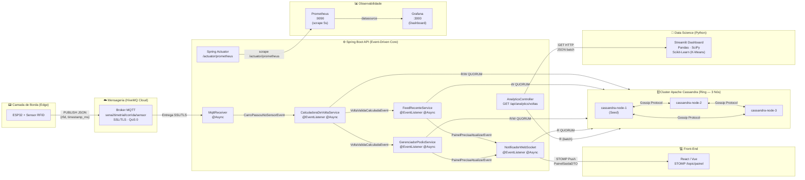
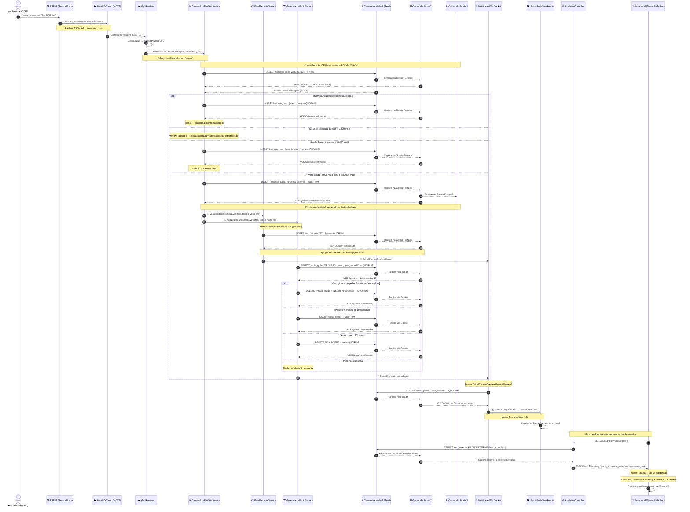

# 🏎️ Time Trial API

> Sistema de cronometragem de alta precisão para corridas de carrinhos com sensores RFID — processamento de eventos em tempo real, arquitetura distribuída orientada a eventos, cluster de banco de dados com consenso quórum e módulo de Data Science integrado.

---

## Badges


---

## 📖 Sobre o Projeto

A **Time Trial API** é o núcleo de um sistema de cronometragem de nível Enterprise inspirado no universo Hot Wheels. Sensores RFID instalados na pista leem as tags dos carrinhos ao passarem pelos pontos de controle, e cada leitura dispara uma cadeia completa de eventos: do hardware físico até o ranking exibido em tempo real no navegador.

O sistema foi projetado para lidar com **altíssima taxa de eventos por segundo** (alto throughput IoT), garantindo que nenhuma leitura seja perdida e que a atualização do placar chegue ao Front-End em milissegundos. A arquitetura evoluiu de uma API monolítica para um **sistema distribuído de alta volumetria**, com cluster de banco de dados com replicação e consenso quórum, observabilidade full-stack via Prometheus e Grafana, e um módulo dedicado de Data Science para análise de clustering e detecção de anomalias.

---

## 🏗️ Arquitetura do Sistema

O sistema é construído sobre três pilares de engenharia de alta performance:

1. **Event-Driven Core** — processamento totalmente assíncrono via `ApplicationEventPublisher` do Spring, com handlers paralelos em pool de threads dedicado.
2. **Distributed Storage** — cluster ring de 3 nós Apache Cassandra com replicação `NetworkTopologyStrategy` e consistência `QUORUM` para todas as operações críticas.
3. **Bimodal Output** — saída de dados em dois modos: *push* em tempo real via WebSocket e *pull* em lote via REST para o módulo de Data Science.

---

### Diagrama 1 — Arquitetura e Fluxo de Dados


```mermaid
flowchart LR
    subgraph BORDA["📟 Camada de Borda (Edge)"]
        ESP["ESP32 + Sensor RFID"]
    end

    subgraph MENSAGERIA["☁️ Mensageria (HiveMQ Cloud)"]
        MQTT["Broker MQTT\nsenai/timetrial/corrida/sensor\nSSL/TLS · QoS 0"]
    end

    subgraph BACKEND["⚙️ Spring Boot API (Event-Driven Core)"]
        direction TB
        RECV["MqttReceiver\n@Async"]
        CALC["CalculadoraDeVoltaService\n@EventListener @Async"]
        FEED["FeedRecenteService\n@EventListener @Async"]
        PODIO["GerenciadorPodioService\n@EventListener @Async"]
        NOTIF["NotificadorWebSocket\n@EventListener @Async"]
        ANALYTICS["AnalyticsController\nGET /api/analytics/voltas"]
        ACTUATOR["Spring Actuator\n/actuator/prometheus"]
    end

    subgraph STORAGE["🗄️ Cluster Apache Cassandra (Ring — 3 Nós)"]
        direction LR
        C1["cassandra-node-1\n(Seed)"]
        C2["cassandra-node-2"]
        C3["cassandra-node-3"]
        C1 <-->|"Gossip Protocol"| C2
        C2 <-->|"Gossip Protocol"| C3
        C1 <-->|"Gossip Protocol"| C3
    end

    subgraph OBS["📊 Observabilidade"]
        PROM["Prometheus\n:9090\n(scrape 5s)"]
        GRAF["Grafana\n:3000\n(Dashboard)"]
    end

    subgraph FRONTEND["💻 Front-End"]
        REACT["React / Vue\nSTOMP /topic/painel"]
    end

    subgraph DATASCIENCE["🔬 Data Science (Python)"]
        STREAMLIT["Streamlit Dashboard\nPandas · SciPy\nScikit-Learn (K-Means)"]
    end

    ESP -->|"PUBLISH JSON\n{rfid, timestamp_ms}"| MQTT
    MQTT -->|"Entrega SSL/TLS"| RECV
    RECV -->|"CarroPassouNoSensorEvent"| CALC
    CALC -->|"VoltaValidaCalculadaEvent"| FEED
    CALC -->|"VoltaValidaCalculadaEvent"| PODIO
    FEED -->|"PainelPrecisaAtualizarEvent"| NOTIF
    PODIO -->|"PainelPrecisaAtualizarEvent"| NOTIF

    CALC -->|"R/W QUORUM"| STORAGE
    FEED -->|"W QUORUM"| STORAGE
    PODIO -->|"R/W QUORUM"| STORAGE
    NOTIF -->|"R QUORUM"| STORAGE
    ANALYTICS -->|"R (batch)"| STORAGE

    NOTIF -->|"STOMP Push\nPainelSaidaDTO"| REACT
    ANALYTICS -->|"GET HTTP\nJSON batch"| STREAMLIT

    ACTUATOR -->|"scrape /actuator/prometheus"| PROM
    PROM -->|"datasource"| GRAF
```

---

### Diagrama 2 — Fluxo de Sequência Event-Driven (com QUORUM e Data Science)


```mermaid
sequenceDiagram
    autonumber
    actor Carro as 🏎️ Carrinho (RFID)
    participant Edge as 📟 ESP32 (Sensor/Borda)
    participant Broker as ☁️ HiveMQ Cloud (MQTT)
    participant Receiver as 📥 MqttReceiver
    participant Calc as ⚙️ CalculadoraDeVoltaService
    participant Feed as 📋 FeedRecenteService
    participant Podio as 🏆 GerenciadorPodioService
    participant C1 as 🗄️ Cassandra Node-1 (Seed)
    participant C2 as 🗄️ Cassandra Node-2
    participant C3 as 🗄️ Cassandra Node-3
    participant Notif as 📡 NotificadorWebSocket
    participant Front as 💻 Front-End (Vue/React)
    participant Analytics as 📊 AnalyticsController
    participant DS as 🔬 Dashboard (Streamlit/Python)

    %% --- Camada de Entrada: Hardware → MQTT → API ---
    Carro->>Edge: Passa pelo sensor (Tag RFID lida)
    Edge->>Broker: PUBLISH senai/timetrial/corrida/sensor
    Note over Edge,Broker: Payload JSON: {rfid, timestamp_ms}
    Broker-->>Receiver: Entrega mensagem (SSL/TLS)
    Receiver->>Receiver: Desserializa → SensorPayloadDTO

    %% --- Evento 1: Sensor detectado ---
    Receiver-)Calc: 🔔 CarroPassouNoSensorEvent(rfid, timestamp_ms)
    Note over Receiver,Calc: @Async — thread do pool "event-"

    Note over Calc,C3: Consistência QUORUM — aguarda ACK de 2/3 nós
    Calc->>C1: SELECT historico_carro WHERE carro_id = rfid
    C1-->>C2: Replica read repair (Gossip)
    C2-->>Calc: ACK Quórum (2/3 nós confirmaram)
    C1-->>Calc: Retorna última passagem (ou null)

    alt Carro nunca passou (primeira leitura)
        Calc->>C1: INSERT historico_carro (marco zero) — QUORUM
        C1-->>C2: Replica via Gossip Protocol
        C2-->>Calc: ACK Quórum confirmado
        Note over Calc: Ignora — aguarda próxima passagem
    else Bounce detectado (tempo < 2.000 ms)
        Note over Calc: WARN: Ignorado — leitura duplicada/ruído (stampede effect filtrado)
    else DNF / Timeout (tempo > 30.000 ms)
        Calc->>C1: INSERT historico_carro (reinicia marco zero) — QUORUM
        C1-->>C2: Replica via Gossip Protocol
        C2-->>Calc: ACK Quórum confirmado
        Note over Calc: WARN: Volta reiniciada
    else ✅ Volta válida (2.000 ms ≤ tempo ≤ 30.000 ms)
        Calc->>C1: INSERT historico_carro (novo marco zero) — QUORUM
        C1-->>C2: Replica via Gossip Protocol
        C2-->>C3: Replica via Gossip Protocol
        C2-->>Calc: ACK Quórum confirmado (2/3 nós)
        Note over Calc,C3: Consenso distribuído garantido — dados duráveis

        %% --- Evento 2: Volta válida calculada (processamento paralelo) ---
        Calc-)Feed: 🔔 VoltaValidaCalculadaEvent(rfid, tempo_volta_ms)
        Calc-)Podio: 🔔 VoltaValidaCalculadaEvent(rfid, tempo_volta_ms)
        Note over Feed,Podio: Ambos consomem em paralelo (@Async)

        %% --- FeedRecenteService ---
        Feed->>C1: INSERT feed_recente (TTL: 60s) — QUORUM
        C1-->>C2: Replica via Gossip Protocol
        C2-->>Feed: ACK Quórum confirmado
        Note over Feed,C2: agrupador="GERAL", timestamp_ms atual
        Feed-)Notif: 🔔 PainelPrecisaAtualizarEvent

        %% --- GerenciadorPodioService ---
        Podio->>C1: SELECT podio_global ORDER BY tempo_volta_ms ASC — QUORUM
        C1-->>C2: Replica read repair
        C2-->>Podio: ACK Quórum — Lista dos top 10

        alt Carro já está no pódio E novo tempo é melhor
            Podio->>C1: DELETE entrada antiga + INSERT novo tempo — QUORUM
            C1-->>C2: Replica via Gossip
            C2-->>Podio: ACK Quórum confirmado
        else Pódio tem menos de 10 entradas
            Podio->>C1: INSERT podio_global — QUORUM
            C1-->>C2: Replica via Gossip
            C2-->>Podio: ACK Quórum confirmado
        else Tempo bate o 10º lugar
            Podio->>C1: DELETE 10º + INSERT novo — QUORUM
            C1-->>C2: Replica via Gossip
            C2-->>Podio: ACK Quórum confirmado
        else Tempo não classifica
            Note over Podio: Nenhuma alteração no pódio
        end

        Podio-)Notif: 🔔 PainelPrecisaAtualizarEvent
    end

    %% --- Evento 3: Notificação WebSocket ---
    Note over Notif: Escuta PainelPrecisaAtualizarEvent (@Async)
    Notif->>C1: SELECT podio_global + feed_recente — QUORUM
    C1-->>C2: Replica read repair
    C2-->>Notif: ACK Quórum — Dados atualizados

    Notif-)Front: 📤 STOMP /topic/painel → PainelSaidaDTO
    Note over Notif,Front: {podio: [...], recentes: [...]}
    Front->>Front: Atualiza ranking e feed em tempo real

    %% --- Ramificação: Data Science (Pull/Batch) ---
    Note over DS,Analytics: Fluxo assíncrono independente — batch analytics
    DS->>Analytics: GET /api/analytics/voltas (HTTP)
    Analytics->>C1: SELECT feed_recente ALLOW FILTERING (batch completo)
    C1-->>C2: Replica read repair (time-series scan)
    C2-->>Analytics: Retorna histórico completo de voltas
    Analytics-->>DS: 200 OK — JSON array [{carro_id, tempo_volta_ms, timestamp_ms}]
    Note over DS: Pandas: limpeza · SciPy: estatísticas
    Note over DS: Scikit-Learn: K-Means clustering + detecção de outliers
    DS->>DS: Renderiza gráficos interativos (Streamlit)
```

---

## 🧠 Decisões Arquiteturais

### 📟 Dispositivos de Borda (Edge Computing)
Microcontroladores **ESP32** são responsáveis pela leitura das tags RFID diretamente na pista. Ao detectar um carrinho, o ESP32 publica imediatamente um payload JSON no broker MQTT com o identificador da tag (`rfid`) e o timestamp preciso em milissegundos (`timestamp_ms`). Isso mantém a lógica de negócio inteiramente no backend, deixando o hardware leve e intercambiável.

### ☁️ Mensageria com MQTT (HiveMQ Cloud)
O protocolo **MQTT** foi escolhido por ser extremamente leve e confiável para dispositivos IoT com conectividade instável. O broker **HiveMQ Cloud** atua como intermediário: mesmo que a API esteja temporariamente indisponível, as mensagens não são perdidas. Essa camada desacopla completamente o hardware da lógica de negócio.

| Atributo | Valor |
|---|---|
| Protocolo | MQTT sobre SSL/TLS |
| Broker | HiveMQ Cloud |
| Tópico | `senai/timetrial/corrida/sensor` |
| QoS | 0 (at-most-once) |

### ⚙️ Processamento Assíncrono (Spring Boot)
O backend consome os eventos MQTT de forma **totalmente assíncrona**, usando o sistema de eventos do Spring (`ApplicationEventPublisher`). Cada mensagem recebida dispara um `CarroPassouNoSensorEvent`, que é processado em thread separada pelo `CalculadoraDeVoltaService`. Isso garante que a thread do receiver MQTT nunca fique bloqueada, maximizando o throughput.

### 🗄️ Banco de Dados Time-Series em Cluster (Apache Cassandra)
A escolha do **Apache Cassandra** não foi acidental. O sistema opera sobre um **cluster ring de 3 nós** com replicação configurada via `NetworkTopologyStrategy` no datacenter `dc1`, garantindo que cada escrita seja replicada em todos os nós do anel. O modelo de dados foi desenhado especificamente para o padrão de acesso desta aplicação — altíssima taxa de escrita e leituras ordenadas por tempo (time-series):

| Tabela | Partition Key | Clustering Key | Finalidade |
|---|---|---|---|
| `feed_recente` | `agrupador` | `timestamp_ms DESC` | Últimas voltas de todas as corridas (TTL 60s) |
| `historico_carro` | `carro_id` | `timestamp_ms DESC` | Histórico completo por carrinho |
| `podio_global` | `agrupador` | `tempo_volta_ms ASC` | Ranking ordenado automaticamente |

**Consistência `QUORUM`:** Todas as operações críticas de leitura e escrita utilizam nível de consistência `QUORUM`, o que significa que ao menos **2 dos 3 nós** precisam confirmar a operação antes que ela seja considerada bem-sucedida. Isso garante:

> **Alta disponibilidade:** O cluster continua operando mesmo com a falha de 1 nó (tolerância a falhas: ⌊N/2⌋ + 1 = 2 nós necessários para quórum em um cluster de N=3).
> **Integridade dos dados:** Nenhuma volta é registrada sem o consenso distribuído da maioria do cluster, eliminando leituras sujas e inconsistências de replicação.
> **Escalabilidade horizontal:** Novos nós podem ser adicionados ao cluster ring sem downtime, aumentando o throughput proporcional à capacidade.

O Cassandra é otimizado para gravações (append-only log), o que o torna ideal para séries temporais de alta volumetria IoT. A ordenação da clustering key elimina qualquer necessidade de ordenar os resultados em memória.

### 💻 Comunicação em Tempo Real (WebSockets)
Após processar e persistir uma volta válida, a API notifica o Front-End instantaneamente via **WebSockets** (STOMP sobre SockJS). O cliente Front-End se inscreve no destino `/topic/painel` e recebe um `PainelSaidaDTO` completo a cada atualização, sem precisar fazer polling.

---

## 📊 Telemetria e Observabilidade

A plataforma implementa uma stack completa de observabilidade com três camadas distintas, seguindo o padrão *"instrumentação → coleta → visualização"*:

### Instrumentação — Spring Boot Actuator
A aplicação expõe automaticamente métricas de JVM, pool de threads, conectividade com Cassandra e métricas customizadas de negócio (taxa de ingestão de voltas por segundo) através do endpoint `/actuator/prometheus` em formato **OpenMetrics**.

| Endpoint | Finalidade |
|---|---|
| `/actuator/health` | Status de saúde da aplicação e dependências |
| `/actuator/prometheus` | Métricas em formato Prometheus (scrape target) |
| `/actuator/metrics` | Catálogo de métricas disponíveis |

### Coleta — Prometheus
O **Prometheus** realiza scraping das métricas a cada **5 segundos** (configurado em `prometheus.yml`), armazenando séries temporais comprimidas localmente. Ele monitora tanto a API Spring Boot quanto o próprio processo interno, permitindo alertas e queries em **PromQL**.

```yaml
# prometheus.yml
scrape_configs:
  - job_name: 'time-trial-api'
    metrics_path: '/actuator/prometheus'
    static_configs:
      - targets: ['time-trial-api:8080']
```

### Visualização — Grafana
O **Grafana** (porta `3000`) consome o Prometheus como datasource e exibe dashboards em tempo real. O dashboard principal `taxa_ingestao_telemetria` apresenta a **taxa de ingestão do Cassandra por segundo**, permitindo identificar gargalos de throughput, picos de carga e comportamentos anômalos na pipeline de eventos IoT.

> 💡 Acesse o Grafana em `http://localhost:3000` (credenciais padrão: `admin` / `admin`, configurável via `GRAFANA_ADMIN_PASSWORD` no `.env`).

---

## 🔬 Analytics & Data Science

A arquitetura implementa um modelo de **saída bimodal de dados**, separando o fluxo de tempo real do fluxo analítico:

### Modo 1 — Tempo Real (Push via WebSocket)
Descrito na seção anterior: o `NotificadorWebSocket` envia atualizações instantâneas via STOMP para o Front-End React/Vue após cada volta válida processada.

### Modo 2 — Batch/Analytics (Pull via REST)
Um `AnalyticsController` RESTful expõe o endpoint `GET /api/analytics/voltas`, que retorna o **histórico completo de voltas** em formato JSON sem paginação (full scan). Este endpoint foi desenhado especificamente para ser consumido pelo módulo de Data Science em Python.

| Atributo | Valor |
|---|---|
| Endpoint | `GET /api/analytics/voltas` |
| Resposta | `application/json` — array de objetos `{carro_id, tempo_volta_ms, timestamp_ms}` |
| Frequência | Sob demanda (pull) — não há streaming |
| Destino | Dashboard Streamlit (Python) |

### Stack de Data Science (Python)

O dashboard analítico é construído com o ecossistema Python científico:

| Biblioteca | Função |
|---|---|
| **Streamlit** | Framework de dashboard interativo (UI) |
| **Pandas** | Ingestão, limpeza e transformação do JSON via `pd.read_json` / `requests` |
| **SciPy** | Estatísticas descritivas e testes de hipótese sobre os tempos de volta |
| **Scikit-Learn** | Algoritmo K-Means para **clustering de pilotos** por padrão de desempenho e **detecção de outliers** (voltas anômalas/suspeitas) |

> **Exemplo de insight:** O K-Means agrupa os carrinhos em *clusters* de performance (elite, intermediário, iniciante) com base nos percentis de tempo de volta. O detector de outliers identifica leituras que fogem do padrão esperado — possíveis falhas de sensor ou *bounces* não filtrados.

---

## 🚀 Como Executar (Deploy Portátil)

O projeto utiliza **Docker Compose** com orquestração em cascata: os nós do cluster Cassandra sobem sequencialmente, aguardando o status `UN` (**Up and Normal**) de cada nó via **Gossip Protocol** antes de avançar para o próximo. Somente após o cluster estar 100% sincronizado (verificado via `SELECT rack FROM system.peers`), o container de inicialização cria o keyspace e as tabelas. Em seguida, Prometheus, Grafana e a API Spring Boot são iniciados. Basta configurar o arquivo `.env`.

### Sequência de Inicialização

```
cassandra-1 (Seed) → [healthcheck: cqlsh]
    └─► cassandra-2 (joins ring via Gossip) → [healthcheck: cqlsh]
            └─► cassandra-3 (joins ring via Gossip)
cassandra-init → [aguarda 2 peers via CQL (os outros 2 nós além do seed, conforme system.peers)]
    └─► CREATE KEYSPACE (NetworkTopologyStrategy, dc1:3)
    └─► CREATE TABLEs (feed_recente, historico_carro, podio_global)
prometheus + grafana (iniciam em paralelo após cluster)
time-trial-api → [conecta aos 3 contact-points]
```

### Pré-requisitos

- [Docker](https://www.docker.com/get-started) e Docker Compose instalados
- Uma conta no [HiveMQ Cloud](https://www.hivemq.com/mqtt-cloud-broker/) (plano gratuito disponível)

### 1. Configure o arquivo `.env`

Crie um arquivo `.env` na raiz do projeto com suas credenciais do HiveMQ Cloud e, opcionalmente, a senha do Grafana:

```env
USER_HIVEMQ=seu-usuario-hivemq
PASSWORD_HIVEMQ=sua-senha-hivemq
GRAFANA_ADMIN_PASSWORD=admin
```

> ⚠️ **Nunca faça commit do arquivo `.env` com credenciais reais.** O `.gitignore` já está configurado para ignorá-lo.

### 2. Suba todos os serviços

```bash
docker compose up --build
```

O Docker Compose irá:
1. Subir `cassandra-node-1` (seed do cluster ring) e aguardar o healthcheck
2. Subir `cassandra-node-2`, que ingressa no ring via Gossip Protocol, e aguardar o healthcheck
3. Subir `cassandra-node-3`, que completa o cluster de 3 nós
4. Executar `cassandra-init`: aguardar status `UN` dos 3 nós e criar o keyspace `time_trial` com `NetworkTopologyStrategy` e as tabelas com consistência QUORUM
5. Subir **Prometheus** (`:9090`) e **Grafana** (`:3000`) em paralelo
6. Construir e iniciar a **API Spring Boot**, conectada aos 3 contact-points do cluster

### 3. Endpoints Disponíveis

| Serviço | URL | Descrição |
|---|---|---|
| **API REST** | `http://localhost:8080` | API principal |
| **WebSocket** | `http://localhost:8080/ws-time-trial` | Endpoint SockJS/STOMP |
| **Analytics** | `http://localhost:8080/api/analytics/voltas` | Histórico batch para Data Science |
| **Prometheus** | `http://localhost:9090` | Console de métricas e PromQL |
| **Grafana** | `http://localhost:3000` | Dashboard de observabilidade |

### 4. WebSocket

Conecte seu Front-End ao endpoint WebSocket (SockJS + STOMP):

```
http://localhost:8080/ws-time-trial
```

> O endpoint usa **SockJS**, que negocia a conexão via HTTP antes de fazer o upgrade. Clientes SockJS devem usar o prefixo `http://` (não `ws://`).

Inscreva-se no destino `/topic/painel` para receber atualizações de ranking em tempo real.

---

## 📁 Estrutura do Projeto

```
src/main/java/com/centroweg/iot/time_trial_api/
├── config/              # Configurações (Cassandra, MQTT, WebSocket, Async)
├── core/
│   ├── domain/          # Entidades do Cassandra (FeedRecente, HistoricoCarro, PodioGlobal)
│   ├── event/           # Eventos de domínio (CarroPassouNoSensorEvent, VoltaValidaCalculadaEvent...)
│   ├── repository/      # Interfaces de repositório Spring Data Cassandra
│   └── service/         # Lógica de negócio (CalculadoraDeVolta, FeedRecente, GerenciadorPodio)
├── inbound/
│   ├── dto/             # SensorPayloadDTO (entrada via MQTT)
│   └── mqtt/            # MqttReceiver — consome mensagens do broker
└── outbound/
    ├── dto/             # PainelSaidaDTO (saída via WebSocket)
    └── websocket/       # NotificadorWebSocket — envia updates ao Front-End
```

---

## 🛠️ Tecnologias Utilizadas

| Tecnologia | Versão | Função |
|---|---|---|
| Java | 21 | Linguagem principal |
| Spring Boot | 3.x | Framework da API |
| Spring Data Cassandra | — | Abstração do banco de dados |
| Spring WebSocket (STOMP) | — | Comunicação em tempo real |
| Spring Boot Actuator | — | Exposição de métricas e health checks |
| Eclipse Paho MQTT | — | Cliente MQTT |
| HiveMQ Cloud | — | Broker MQTT gerenciado |
| Apache Cassandra | latest | Banco de dados time-series (cluster 3 nós, QUORUM) |
| Prometheus | latest | Coleta e armazenamento de métricas (scrape 5s) |
| Grafana | latest | Visualização de métricas e dashboards de observabilidade |
| Python | 3.x | Linguagem do módulo de Data Science |
| Streamlit | — | Dashboard interativo de análise |
| Pandas | — | Manipulação e transformação de dados |
| SciPy | — | Análise estatística dos tempos de volta |
| Scikit-Learn | — | K-Means clustering e detecção de outliers |
| Docker / Docker Compose | — | Containerização e orquestração em cascata |
| Lombok | — | Redução de boilerplate |
